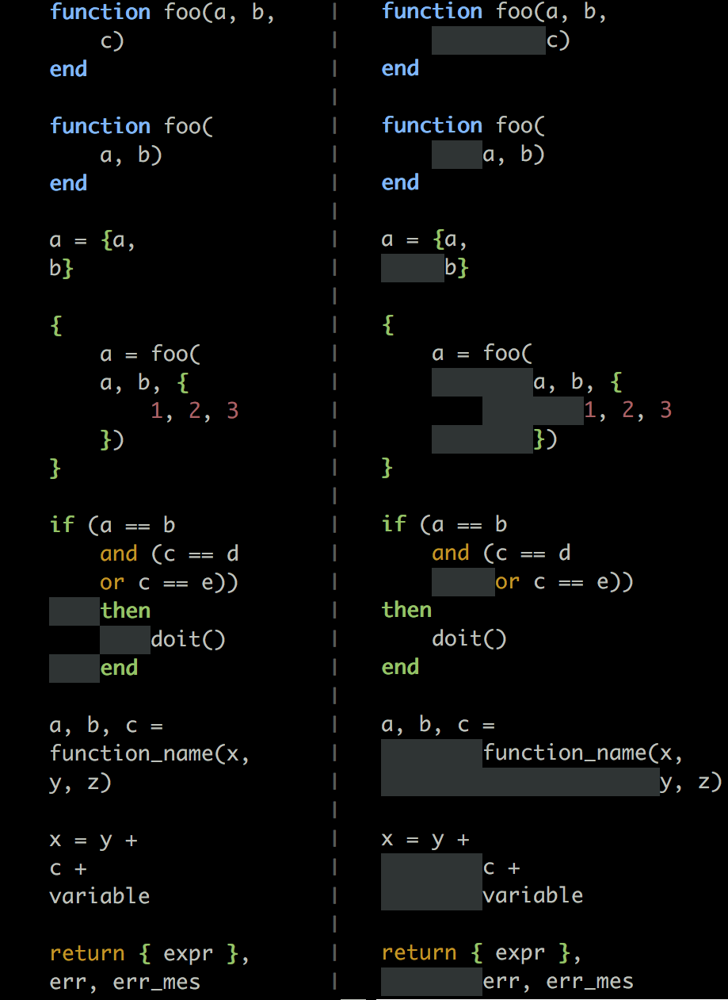

# vim-indent-lua

Better lua indent script for VIM


# Status

This script is in beta phase.


# Description

Improve official lua indent script in several aspects.
Not like the official one, this script indent codes in a true recursive
manner, instead of checking only the previous line.

**Features**:

-   Aligns multi-line function parameters and items in `()`.
-   Aligns members in a table definition.
-   Fix indent of code block in a table `{...}`.
-   Indents the second line for a multi-line expression.


## Before and After using this plugin:




##  Installation

Installing with [pathogen.vim](https://github.com/tpope/vim-pathogen)
 is recommended. Copy and paste:

```sh
cd ~/.vim/bundle
git clone git://github.com/drmingdrmer/vim-indent-lua.git
```

Or manually:

Download [vim-indent-lua.zip](https://github.com/drmingdrmer/vim-indent-lua/archive/master.zip)
and unzip it into `~/.vim`.


# Author

Zhang Yanpo (张炎泼) <drdr.xp@gmail.com>


# Copyright and License

The MIT License (MIT)

Copyright (c) 2015 Zhang Yanpo (张炎泼) <drdr.xp@gmail.com>
